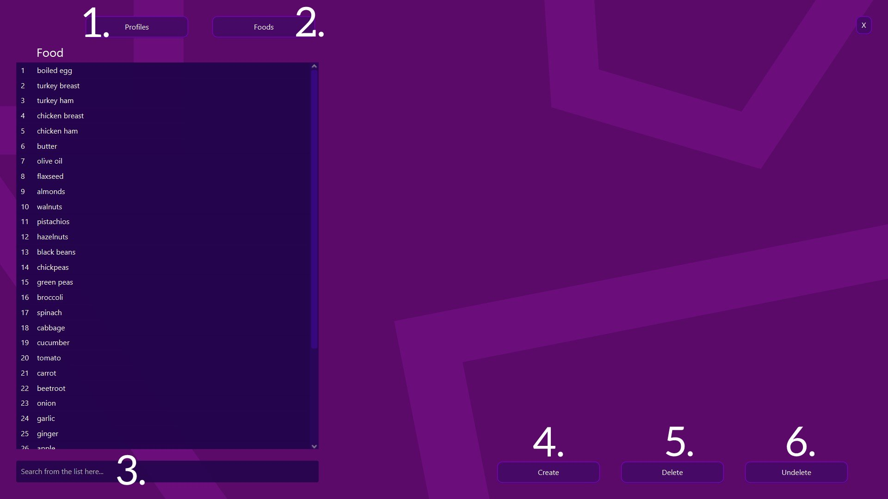
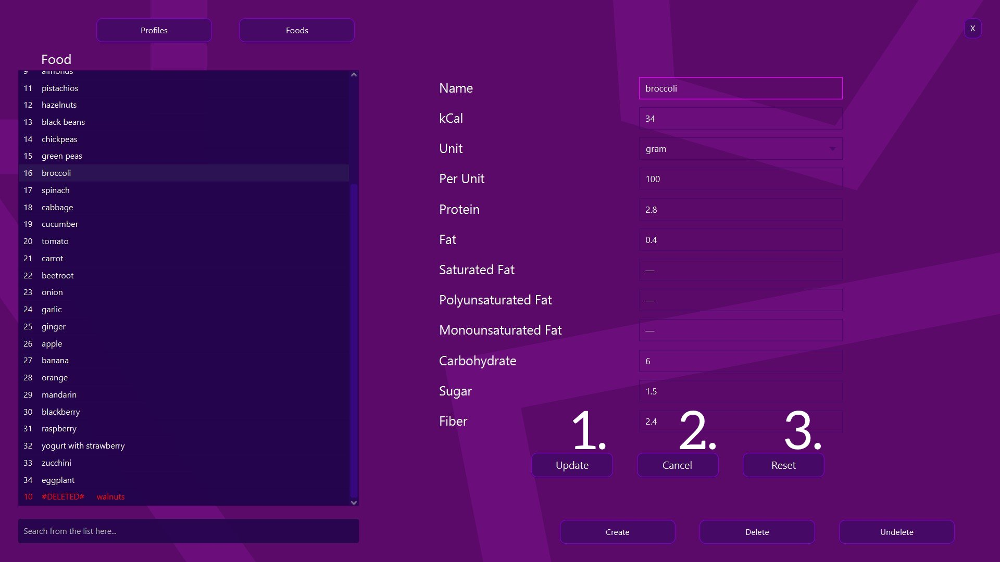
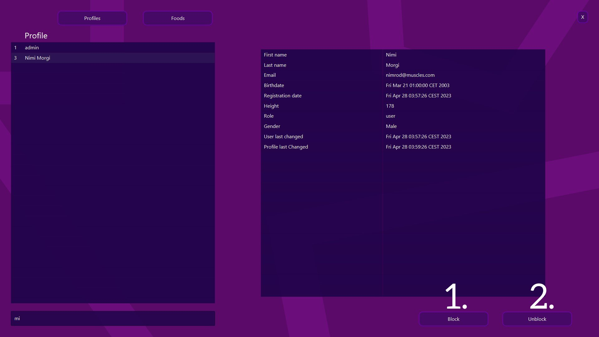

## Muscles Asztali Alkalmazás
Felhasználói dokumentáció

## Főoldal
#### A bejelentkezést követően a főoldal tölt be. Az admin felhasználónév és jelszó a [fejlesztői dokumentációban](../README.md) található meg.

#### Egyes elemek funkciói

1. Kilistázza az összes felhasználó nevét
2. Kilistázza az összes étel nevét
3. Keresés a listában karakter egyezés szerint
4. Új étel létrehozása ablakot betölti
5. Kitörlni a kiválasztott ételt, a listában az étel neve elé bekerül a #DELETED# megjelölés és a lista végére kerül
6. Visszavonja a törlést a kiválasztott ételen

#### Étel vagy profil kiválasztása
Ez egy igen egyszerű folyamat, csak rá kell kattintani a kiválasztani kívánt elemre. Ezután megjelennek a kiválasztott étel vagy profil adatai.

### A kiválasztott étel adatait azon nyomban lehet módosítani.

#### Étel frissítési elemek funkciói
1. A megadott adatokkal a kiválasztott étel frissítése
2. Eltünteti a kiválasztott elem adatait, és a kijelölést is a listából
3. Visszaállítja a kiválasztott étel adatait az eredetire

### A kiválasztott profil adatait meg lehet tekinteni.

#### Profil funkciók
1. Blokkolja a kiválasztott profilt, a listában a profil neve elé bekerül a #BLOCKED# megjelölés és a lista végére kerül
2. Visszavonja a blokkolást a kiválasztott profilon 

## Étel létrehozásának/módosításának feltételei
#### Az itt meghatározott feltételek érvényesek étel módosítása és létrehozása esetén is
- A név mező `[Name]` elfogad bármilyen karaktert
- Az egység mező `[Unit]` 4 értéket `[gram, liter, deciliter, milliliters]` tartalmazó lenyíló lista
- A többi mező mind számot fogad el, egészet és törtet egyaránt
- Egyik mező sem lehet üres, leszámítva a következőket:
  - Telített zsír `[Saturated Fat]`
  - Egyszeresen telítetlen zsír `[Monounsaturated Fat]`
  - Többszörösen telítetlen zsír `[Polyunsaturated Fat]`
  - Rost `[Fiber]`
  - Cukor `[Sugar]`
  
## Fejlesztői Dokumentáció
[Ide kattintva olvashatja el.](../README.md)
